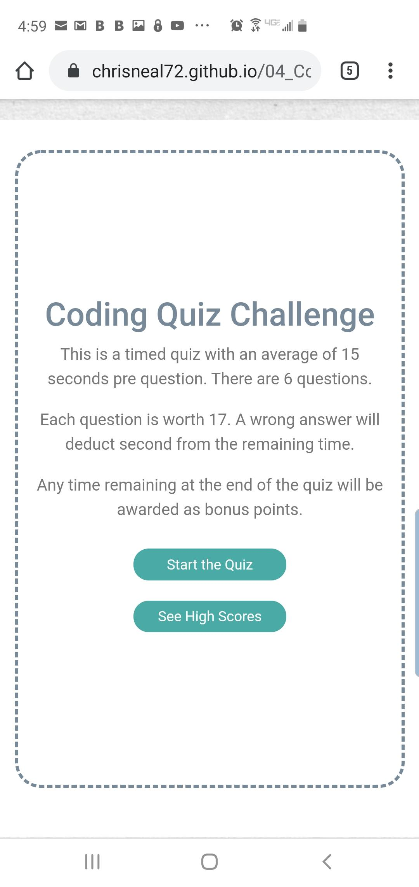
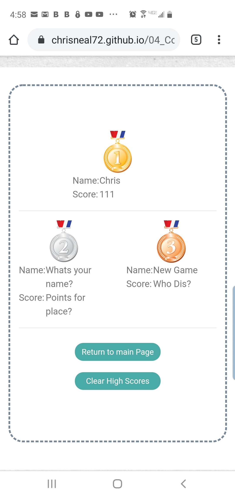
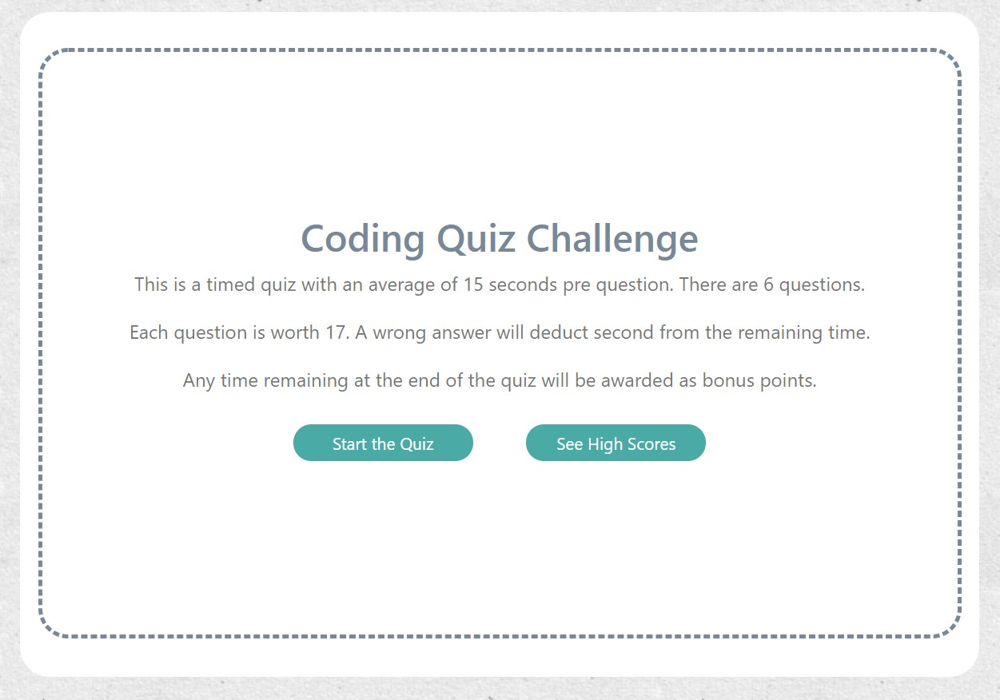
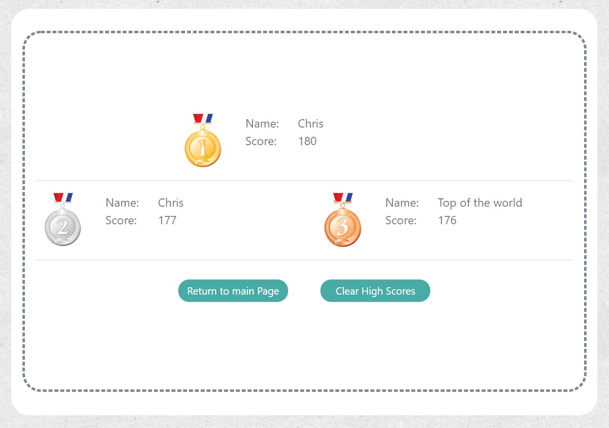

# 04_Code_Quiz
​
### Table of Contents
- [Description](#Description)
- [Technologies-Libraries](#Technologies-Libraries)
- [Screenshots](#Screenshots)
- [Link](#Link)
​
### Description
This is a code Quiz. It asks multiple choice questions. 2 Questions are the stock questions from the assignment and the rest I got from a google search.

The project is all on one HTML page and controlled with CSS and JS. The HTML is a little messy as I changed my approach mid-stream.

I have built in the functionalit I want, however it is not the best looking page. With this course I have done more function over form.

The main page has some numbers on it dealing with questions and scoring. These numbers are dynamic based on the questions. More questions the page updates automatically.

The questions page is looping through 2 functions until the questions are all asked. The questions are in a random order. Each question is updated on the fly and the answer buttons are created at the time the question is asked. Once the question is answered a basic modal appears and a green check or a red X covers the question for 2 seconds. While this is happening I am putting 2 seconds back on the players score.

The end of the quiz shows a few stats and if the person achives a top 3 score they are asked to enter their name. Once the name is entered I blur the section and disable the inputs. Before recording the score I determine where it should go in the list, the I splice it in. If the length of the array is more than 3 I trim off the lowest score.

The high score page show the top 3 scores. The scores are stored in localStorage.

​
### Technologies-Libraries
- [Bootstrap](https://getbootstrap.com/) - CSS Framework
​
### Screenshots
​
Main Screen as seen from my Phone

​
High Scores page from my phone

​
Main page in a browser

​
High Score page from a browser

​
### Link
Check it out! 
https://chrisneal72.github.io/04_Code_Quiz/